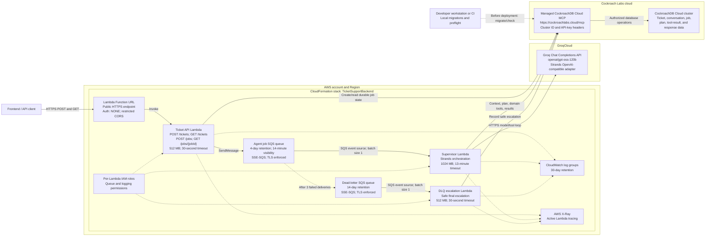
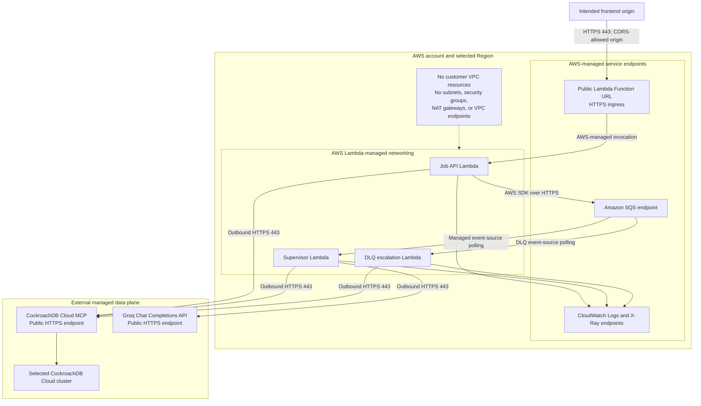

# AWS CDK infrastructure

This package is the single deployment source of truth for the asynchronous ticket supervisor. It
defines three Node.js Lambda functions, the work queue and dead-letter queue, the public Function
URL, event-source mappings, log retention, and least-privilege IAM grants.

The Lambda application remains in `../app/SupervisorAgent`; CDK bundles its three composition roots
with esbuild during synthesis and deployment.

## Infrastructure architecture

### Runtime request and processing flow



The request Lambda persists a job before placing its versioned message on SQS. The supervisor is
invoked asynchronously and processes one SQS record at a time. Failed messages are retried up to
three deliveries before SQS moves them to the DLQ, where the final handler records a customer-safe
escalation. Clients poll the public Function URL for the durable result.

### Network topology



The stack does not attach the Lambdas to a customer-managed VPC. The only public ingress is the
Function URL. Lambda-to-SQS traffic uses the AWS service endpoint. All three Lambdas make outbound
HTTPS calls to the public CockroachDB Cloud MCP endpoint, while only the supervisor calls Groq over
public HTTPS. Consequently, the stack creates no VPC, subnet, route table, internet gateway, NAT
gateway, security group, or VPC endpoint.

CORS restricts browser access to the configured frontend origin, but it is not authentication. The
Function URL remains publicly invokable because its authorization type is `NONE`.

### AWS resource inventory

| Resource | Purpose and interaction |
| --- | --- |
| CloudFormation stack | Owns and updates the application infrastructure synthesized by CDK. |
| Ticket API Lambda | Validates ticket/job submissions, persists state, publishes SQS messages, and returns ticket/job status. |
| Lambda Function URL | Provides the public `/tickets` and `/jobs` HTTPS interfaces. |
| Agent job SQS queue | Decouples submission from reasoning and triggers the supervisor Lambda. |
| Supervisor Lambda | Loads context, invokes Groq through Strands, calls typed data operations, and stores the outcome. |
| Dead-letter SQS queue | Receives a message after three unsuccessful deliveries from the job queue. |
| DLQ escalation Lambda | Converts exhausted retries into a safe, durable escalation response. |
| IAM roles and policies | Permit only required AWS queue, logging, and tracing actions; Groq uses HTTPS API-key authentication. |
| CloudWatch log groups | Store structured logs for each Lambda for 30 days. |
| AWS X-Ray | Receives active traces from all three Lambda functions. |
| CDK bootstrap resources | Store and publish bundled Lambda assets; these live in the separate `CDKToolkit` stack. |

Groq, CockroachDB Cloud, and its managed MCP endpoint are consumed services; this CDK stack does
not create them. The existing CockroachDB database and its schema are outside CloudFormation.
Versioned migrations run only from a developer workstation or CI before deployment; Lambda
contains no DDL or database-creation path.

## Commands

```powershell
npm install
npm test
```

## Deployment configuration

Deployment settings use this precedence:

1. Variables already supplied by the shell or CI/CD.
2. The local `.env` file.
3. `config/<stage>.json`.
4. Built-in defaults for the model ID and supervisor concurrency.

For local development, copy the sanitized `.env` example and replace every example value:

```powershell
Copy-Item .env.example .env
```

The `.env` file is gitignored. For the current demo deployment it contains the CockroachDB Cloud
cluster ID, database name, MCP service-account API key, Groq API key, and exact frontend origin.
The managed MCP endpoint and Groq API base URL are fixed in code.

This temporary approach injects API keys into Lambda environments and synthesized CloudFormation
output. Only the supervisor receives the Groq key. Do not use this approach for production; restore
Secrets Manager retrieval before promoting the stack beyond a development environment.

Stage-specific JSON configuration remains available when a structured file is more convenient:

```powershell
Copy-Item config/development.example.json config/development.json
```

`development` is the default stage. Select another stage with `DEPLOYMENT_STAGE`, or point directly
to a JSON file with `CDK_CONFIG_FILE`. Select a non-default environment file with `CDK_ENV_FILE`:

```powershell
$env:DEPLOYMENT_STAGE = "staging"
# Reads config/staging.json

$env:CDK_CONFIG_FILE = "C:\secure-config\ticket-support-production.json"
# Explicit file takes precedence over config/<stage>.json

$env:CDK_ENV_FILE = "C:\secure-config\ticket-support-production.env"
```

Environment-only deployment is also supported:

```powershell
$env:COCKROACH_CLOUD_CLUSTER_ID = "01234567-89ab-4def-8123-456789abcdef"
$env:COCKROACH_CLOUD_MCP_API_KEY = "your-cockroach-cloud-service-account-api-key"
$env:COCKROACH_CLOUD_DATABASE = "ticket_support"
$env:CORS_ALLOWED_ORIGIN = "http://localhost:3000"
$env:GROQ_API_KEY = "your-groq-api-key"
$env:GROQ_MODEL_ID = "openai/gpt-oss-120b" # optional
$env:SUPERVISOR_RESERVED_CONCURRENCY = "0" # optional; 0 means no reservation
```

The required settings are `COCKROACH_CLOUD_CLUSTER_ID`, `COCKROACH_CLOUD_DATABASE`,
`COCKROACH_CLOUD_MCP_API_KEY`, `GROQ_API_KEY`, and `CORS_ALLOWED_ORIGIN`. Find the cluster ID in the
CockroachDB Cloud Console Overview URL. The MCP service account must have Cluster Admin or Cluster
Operator access to that cluster. API keys are accepted only through the environment or ignored
`.env`, not through stage JSON files, to reduce the chance of checking them in. Local `.env*` and
`config/*.json` files are gitignored, while sanitized example templates may be committed.

`SUPERVISOR_RESERVED_CONCURRENCY` defaults to `0`, which omits function-level reserved concurrency
and lets the supervisor use the account's shared concurrency pool. Set a positive value only when
the Region has enough Lambda concurrency quota left to preserve AWS's required unreserved pool.

## Database precondition

Provision the CockroachDB database independently. CDK deliberately does not own it. Apply the
application schema from the local workstation, then run the non-mutating health and permission
preflight:

```powershell
cd ..\app\SupervisorAgent
npm run db:migrate
npm run db:check
cd ..\..\infrastructure
```

`db:migrate` fails if the configured database does not exist. It records each applied migration and
checksum in `public.schema_migrations`; changing an applied migration is rejected, so subsequent
schema changes must be added as new files. `db:check` validates all expected tables and columns,
read access, and the insert/update permissions used by Lambda without retaining probe rows. An
`unauthorized` error means the existing service account still needs a supported cluster role.

Demo data is separate and optional:

```powershell
cd ..\app\SupervisorAgent
npm run db:seed
cd ..\..\infrastructure
```

Neither deployment nor Lambda runs the seed command.

## Deploy

With configuration loaded and the SSO session active, bootstrap each AWS account and Region once:

```powershell
aws sso login
npx cdk bootstrap --termination-protection
```

Then synthesize, review, and deploy without CloudFormation parameter arguments:

```powershell
npm run synth
npm run diff
npm run deploy
```

The `predeploy` lifecycle runs `db:check` and `model:check` locally. CDK is invoked only if the
existing database is healthy, the configured MCP service account has the runtime permissions AWS
will need, and Groq accepts the configured API key and model.

Run `npx cdk diff` before deployment and review IAM or resource replacements. Use separate AWS
accounts for development, staging, and production where available.

## End-to-end smoke test

After `npm run db:migrate`, optional `npm run db:seed`, and `npm run deploy` succeed, use the stack
output URL:

```powershell
$ApiUrl = "https://d5hunnxpid2jrxnucitqf5kdpq0rvxaa.lambda-url.us-east-1.on.aws/"
$Request = @{
  subject = "Package has not arrived"
  description = "My delivery was expected yesterday but has not arrived."
  category = "delivery"
} | ConvertTo-Json

$Submitted = Invoke-RestMethod -Method Post -Uri "${ApiUrl}tickets" `
  -ContentType "application/json" -Body $Request
$Submitted

do {
  Start-Sleep -Seconds 3
  $Result = Invoke-RestMethod -Method Get -Uri "${ApiUrl}jobs/$($Submitted.jobId)"
  $Result
} while ($Result.status -in @("queued", "running"))
```

The terminal status should be `completed` or a safe `escalated`, and both include `response`.
